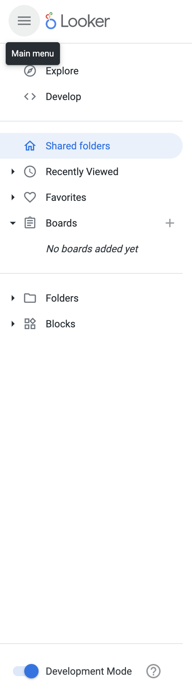
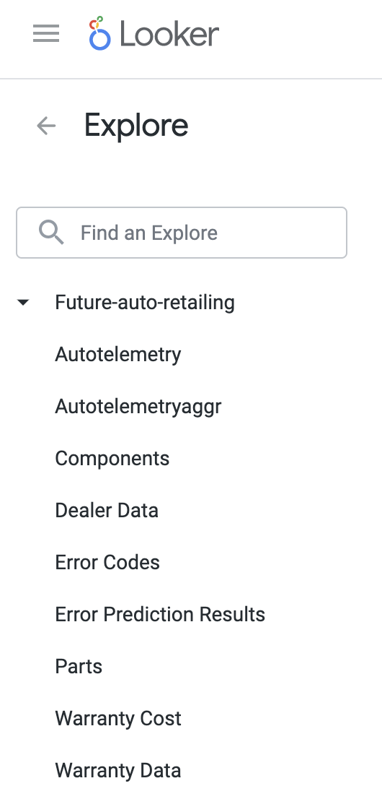
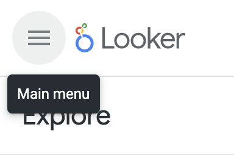
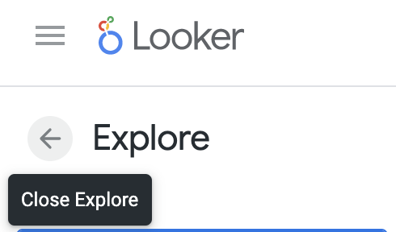
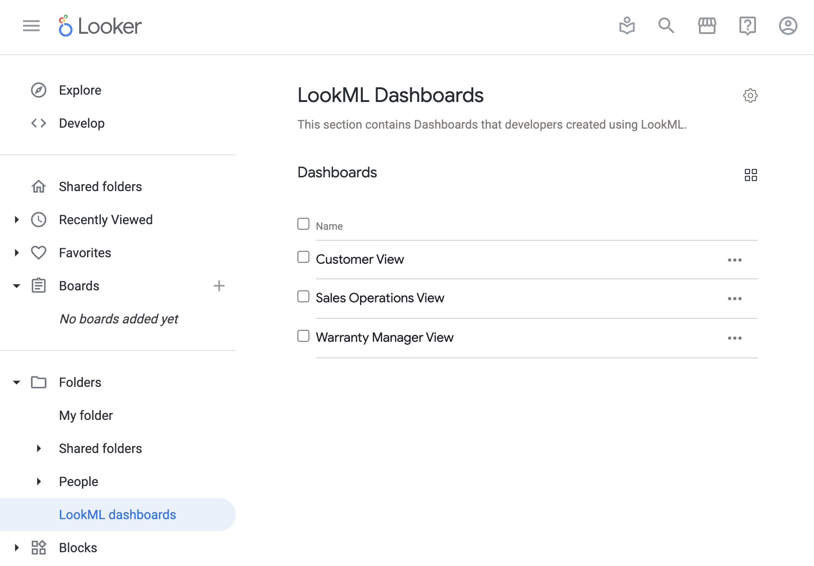
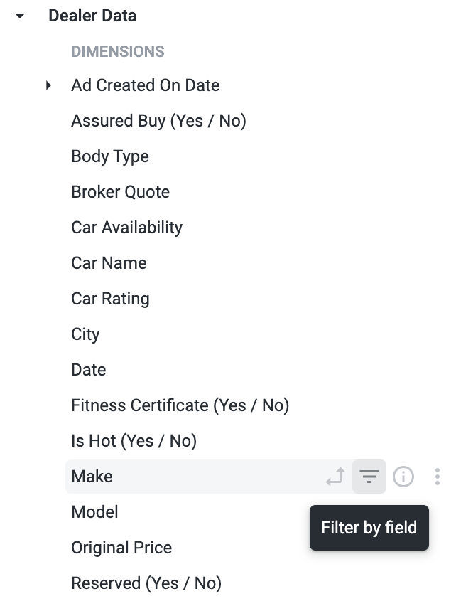
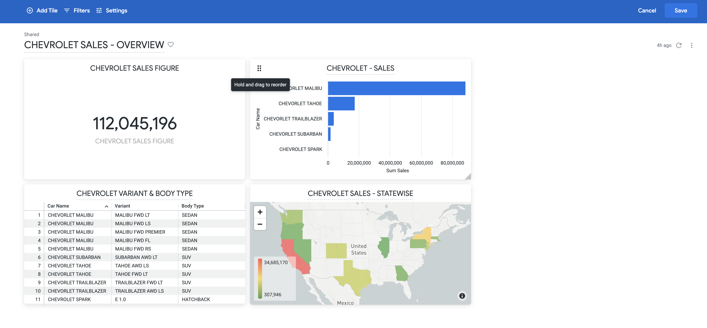

<style>
img {
  border: 1px solid BLACK;
  width : 600px;
}
</style>


# Re-Inventing the Automotive Customer Experience

## **Overview**

Google’s Vertex AI users can act rapidly and efficiently with the reduced overhead of complex analytics. AI suggests actions and generates detailed reports based on all the combined data from various sources. In this lab,  you will predict which vehicles are likely to experience part failure based on their usage pattern and configuration, and which are likely not to have any problems.

BigQuery can be an excellent source and sink for the data that is being used in Vertex AI. You will ceate few views which are required to create ML model in VERTEX AI and Looker Dashboard. Looker is a modern data platform in Google Cloud that lets users analyze and visualize  data interactively.


### **Objectives**
* Create views in BigQuery.
* Build a ML model and Predict using VertexAI.
* Create Dashboard using Looker.

## **Setup**
### **Before you click the Start Lab button**
Read these instructions. Labs are timed and you cannot pause them. The timer, which starts when you click **Start Lab**, shows how long Google Cloud resources will be made available to you.

This Qwiklabs hands-on lab lets you do the lab activities yourself in a real cloud environment, not in a simulation or demo environment. It does so by giving you temporary credentials that you use to sign in and access Google Cloud for the duration of the lab.

### **What you need**
To complete this lab, you need:

* Access to a standard internet browser (Chrome browser recommended).
* Time to complete the lab.


**Note:** If you already have your own personal Google Cloud account or project, do not use it for this lab.

**Note:** If you are using a ChromeOS device, open an Incognito window to run this lab.

### **Log in to Google Cloud Console**
Using the Qwiklabs browser tab/window or the separate browser you are using for the Qwiklabs session, copy the Username from the Connection Details panel and click the **Open Google Console** button.

You'll be asked to Choose an account. Click **Use another account**.


Paste in the Username, and then the Password as prompted:


Accept the terms and conditions.

Since this is a temporary account, which you will only have to access for this one lab:

* Do not add recovery options
* Do not sign up for free trials
  


### **Activate Google Cloud Shell**

Google Cloud Shell is a virtual machine that is loaded with development tools. It offers a persistent 5GB home directory and runs on the Google Cloud. Google Cloud Shell provides command-line access to your GCP resources.

1. In GCP console, on the top right toolbar, click the Open Cloud Shell button.


2. Click **Continue**.


It takes a few moments to provision and connect to the environment. When you are connected, you are already authenticated, and the project is set to your _PROJECT_ID_. For example:


**gcloud** is the command-line tool for Google Cloud Platform. It comes pre-installed on Cloud Shell and supports tab-completion.

You can list the active account name with this command:

``` gcloud auth list ```

Output:

```
Credentialed accounts:
 - <myaccount>@<mydomain>.com (active)
```

Example output:

```
Credentialed accounts:
 - google1623327_student@qwiklabs.net
```

You can list the project ID with this command:

```
gcloud config list project
```

Output:

```
[core]
project = <project_ID>
```

Example output:

```
[core]
project = qwiklabs-gcp-44776a13dea667a6

```
Full documentation of gcloud is available on [Google Cloud gcloud Overview](https://cloud.google.com/sdk/gcloud).

## **Data Preprocessing in BigQuery**

The required data for the lab is preloaded into the BigQuery. We will use this dataset to prepare the train and test set that is required to build a ML model and predictions.

### **Load Bigquery UI**


1. In the **Navigation Menu**, click **BigQuery**.


2. In the **Explorer pane**, drill down to your project and click on **autorepair** dataset.

### **Prepare data for training, testing and prediction**

Now, we will create Views from the Tables in the Dataset for training, testing and prediction purposes.

1. **Copy and paste the query below into the editor and click run**. This query creates a view called **autoelemetry_aggr** using the *autoelemetry* and *vindevicemapping* tables. It is a complete set of Data for ML Modeling.

```sql
create or replace view `autorepair.autotelemetry_aggr`
as
(
select  a.date,
        a.gps_speed,
        a.battery,
        a.cTemp,
        a.eLoad,
        a.iat,
        a.imap,
        a.kpl,
        a.maf,
        a.rpm,
        a.speed,
        a.tAdv,
        a.tPos,
        a.dtc ,
        b.vin
from 
( SELECT  DATE(timestamp) as date,
        deviceId,
        avg(gps_speed) as gps_speed,
        avg(battery) as battery,
        avg(cTemp) as cTemp,
        avg(eLoad) as eLoad,
        avg(iat) as iat,
        avg(imap) as imap,
        avg(kpl) as kpl,
        avg(maf) as maf,
        avg(rpm) as rpm,
        avg(speed) as speed,
        avg(tAdv) as tAdv,
        avg(tPos) as tPos,
        max(dtc) as dtc
FROM `autorepair.autotelemetry`
group by DATE(timestamp) , deviceId
) a
inner join  `autorepair.vindevicemapping` b
on a.deviceId = b.deviceId
)
```


2. Copy and paste the query below in the **Editor** and click **RUN**.

```sql
create or replace view `autorepair.autotelemetry_predict`
as
(
SELECT * FROM `autorepair.autotelemetry_aggr` 
where extract(month from date) in UNNEST([10,11,12])
);

create or replace view `autorepair.autotelemetry_test`
as
(
SELECT * FROM `autorepair.autotelemetry_aggr` 
where extract(month from date) in UNNEST([10])
);

create or replace view `autorepair.autotelemetry_train`
as
(
SELECT * FROM `autorepair.autotelemetry_aggr` 
where extract(month from date) in UNNEST([8,9])
);
``` 


These queries will create three more views : **autotelemetry_predict**, **autotelemetry_test** and **autotelemetry_train**. Dividing **autoelemetry_aggr** to create  datasets for training, testing and prediction purposes.

## **ML Modeling in Vertex AI**
### **Create a Vertex AI notebook**


1. Go to the **Navigation menu** then **Vertex AI** and select **Workbench**.


2. Click **NEW NOTEBOOK** and select Python 3.
3. Give a new notebook name or keep it default.
4. Leave the rest of the settings as default.


5. Click **Create** and wait till the Notebook is provisioned.

### **Create and Train the AI model**


1. Click **OPEN JUPYTERLAB**. It will open a Jupyter lab in a new tab.


2. Select **Python 3**. An untitled ipynb file will open up.
3. Rename it as **autorepair.ipynb**.
4. Copy and paste the below command in autorepair.ipynb file and click **Run**.This command installs the pandas_gbq package which is required to load data from Google BigQuery to Notebook.
   
```python
%pip install pandas_gbq
```


5. Setup Google Project. Copy and paste the code below and click **Run**. 
```python
Project_ID = !(gcloud config get-value core/project)
Project_ID = Project_ID[0]
```

6. Copy and paste the code below and click **Run**. This code imports the packages required for this demo.
```python
#!/usr/bin/env python
# coding: utf-8

# ## Predictive Maintenance Based on Car Telemetry Data

# The notebook does the following :
# 1. Vehicle telemetry train , test and prediction data is fetched from bigquery instance. The data is fetched from the schema Project_ID.autorepair
# 2. The dependent variable in the dataset is dtc (error code). There are 3 possible values of error code 0,1,2
# 3. For predicting error in the vehicle from the telemetry data , any error is checked to occur in the next 3 days from the current record instance . The prediction is 3 days in advance
# 4. Based on the model prediction is done on the predict dataset

import pandas_gbq
import pandas     as pd
import numpy      as np
import sklearn    as sk
import pandas as pd
from sklearn.tree import DecisionTreeClassifier
from sklearn.discriminant_analysis import LinearDiscriminantAnalysis
from sklearn.naive_bayes import GaussianNB
from sklearn.svm import SVC
import matplotlib.pyplot as plt
from sklearn.metrics import classification_report
from sklearn.metrics import confusion_matrix
from sklearn.metrics import plot_confusion_matrix
import warnings
import seaborn as sn
import matplotlib
warnings.filterwarnings('ignore')
feature_names = ['gps_speed' , 'battery' , 'cTemp' , 'eLoad' , 'iat' , 'imap' , 'kpl' , 'maf' , 'rpm' , 'speed' , 'tAdv' , 'tPos']
```

6. Copy and paste the code below and click **Run**. This code checks for any error code for a window of current day + 3 days.
```python
# **Check for any error code for a window of current day + 3 days**

def compute_window(data):
    temp1 = data[['date' , 'vin' , 'dtc']]
    temp2 = temp1
    joined_df = pd.merge(temp1,temp2,on=['vin'])
    joined_df = joined_df[joined_df.date_x <= joined_df.date_y]
    joined_df = joined_df[joined_df.date_x >= (joined_df.date_y - pd.DateOffset(days=3))]
    joined_df = joined_df[['date_x', 'vin' , 'dtc_y']]
    joined_df = joined_df.groupby(by=['date_x', 'vin']).max().reset_index()
    joined_df.rename(columns={'date_x': 'date', 'dtc_y': 'dtc'}, inplace=True)
    datamerged = pd.merge (data,joined_df , on=['vin' , 'date'])
    datamerged = datamerged.drop(['dtc_x'], axis=1)
    datamerged.rename(columns={'dtc_y': 'dtc'}, inplace=True)
    return datamerged
```

7. Copy and paste the code below and click **Run**. This code prepares the dataset for training, testing and prediction.
```python
# **Prepare the dataset for train , test , predict**

def prepare_data(data):
    
    data['dtc'] = data['dtc'].astype(int)
    data = compute_window(data)
    X = data[feature_names].values
    Y = data['dtc'].values
    return X,Y
```

8. Copy and paste the code below and click **Run**. This code runs the model and prints the classification report and the confusion matrix.
```python
# **Run model and print classification report & confusion matrix**

def model_fit(trainX, trainY , testX, testY , modelType):   
    if modelType == 'LDA':
        clf = LinearDiscriminantAnalysis().fit(trainX, trainY)
        print("\033[1m" + "LDA Model" + "\033[0m")
    elif modelType == 'DT':
        clf = DecisionTreeClassifier().fit(trainX, trainY)
        print("\033[1m" + "Decision Tree Model" + "\033[0m")
    elif modelType == 'GNB':  
        clf = GaussianNB().fit(trainX, trainY)
        print("\033[1m" + "Gaussian Naive Bayes Model:" + "\033[0m")
    elif modelType == 'SVM':  
        clf = SVC().fit(trainX, trainY)
        print("\033[1m" + "Support Vector Machines Model:" + "\033[0m")    
             
    print('Accuracy on training set: {:.2f}'
         .format(clf.score(trainX, trainY)))
    print('Accuracy on test set: {:.2f}'
         .format(clf.score(testX, testY)))
    pred = clf.predict(testX)
    #print ("Confusion Matrix :")
    #print(confusion_matrix(testY, pred))
    print ("\033[1m" + "Classification Report : " + "\033[0m")
    print(classification_report(testY, pred))
    print ("\033[1m" + "Confusion Matrix :"  + "\033[0m")
    matplotlib.rcParams.update(matplotlib.rcParamsDefault)
    plot_confusion_matrix(clf, testX, testY , cmap=plt.cm.Blues )
    plt.show()
    return clf

```


11. Copy and paste the code below and click **Run**. This code does the analysis.
```python
def feature_analysis(data):
    corrMatrix = data[feature_names].astype(int).corr()
    sn.heatmap(corrMatrix, annot=True , cmap="YlGnBu")
    print ("\033[1m" + "Correlation Report for independent variables : " + "\033[0m")
    plt.show()
 ```
12. Copy and paste the code below and click run. This code gets and runs the training and testing data from BigQuery Dataset. 

```python
# **Select training data**

get_ipython().run_cell_magic('bigquery', 'trainData', f'SELECT * FROM `{Project_ID}.autorepair.autotelemetry_train`')

# **Select test data**

get_ipython().run_cell_magic('bigquery', 'testData', f'SELECT * FROM `{Project_ID}.autorepair.autotelemetry_test`')
```

13. Copy and paste the code below and click **Run**. This code shows the Correlation report for independent variables.
```python
feature_analysis(trainData)
```


14.  Copy and paste the code below and click **Run**. This code prints the Accuracy based on Gaussain Naive Bayes model, Classification report and Confusion matrix.
```python
# **Execute model training**

trainX,trainY = prepare_data(trainData)
testX,testY = prepare_data(trainData)
clf = model_fit(trainX, trainY , testX, testY , 'GNB')
```


15.  Copy and paste the code below and click **Run**. This code gets the prediction data.

```python
# **Select prediction data**

get_ipython().run_cell_magic('bigquery', 'predictData', f'SELECT * FROM `{Project_ID}.autorepair.autotelemetry_predict`')
```

16. Copy and paste the code below and click **Run**. This code gives the prediction output and saves the result to bigquery.

```python
# **Predict output and save results back to Big Query**

predictX,predictY = prepare_data(predictData)
output = predictData.iloc[:, predictData.columns != 'dtc']
output = output[['vin' , 'date']]
output['dtcPredicted'] = clf.predict(predictX)
output.to_gbq('autorepair.predict_results', project_id=Project_ID,if_exists='replace', table_schema=[{'name': 'vin', 'type': 'STRING'},{'name': 'date', 'type': 'DATE'},{'name': 'dtcPredicted', 'type': 'INTEGER'}])
```

17. Copy and paste the code below and click **Run**.
```python
np.unique(clf.predict(predictX))
```

### **Exploring Bigquery after AI Model training**


1. Go to BigQuery in the Cloud Console.
2. In the **Explorer pane**, drill into your project and then the **autorepair** dataset.
3. **predict_results** table is in  **autorepair** dataset.
4. Click on **COMPOSE NEW QUERY**.
5. Copy and paste the query below in the **Editor**. This query will create a View named **warrantyview** which is used for analysis in the **Looker**.
```sql
create or replace view `autorepair.warrantyview`
as (
select 
b.vin , 
City , 
State, 
a.date , 
make , 
model , 
warranty_av,
dtcPredicted ,
c.Repair_Cost,
c.Description,
c.Manpower
from 
`autorepair.predict_results` as a 
inner join 
`autorepair.dealerdata` as b 
on a.vin = b.vin
inner join 
`autorepair.errorcodes` as c 
on a.dtcPredicted = c.Error_Code
)
```

## Exploring and Creating a Dashboard in Looker
### **Login to Looker**

Using the Qwiklabs browser tab/window or the separate browser you are using for the Qwiklabs session, click the **Open Looker** and use the credentials to sign in to the Looker instance for this lab.


**Note:** If you use other credentials, you will get errors or incur charges.


Enter the provided Username and Password in the Email and Password fields.

### **Overview** 

For this Lab a Looker Project is already created and loaded with required LookML code. Looker is connected with **autorepair** datset in BigQuery. It contains three Looker Dashboards which gives three different perspective to analyze the data.

In Looker we will perform following actions:
* Explore the Project
* Explore the Dashboards
* Create a Sample Dashboard

### **Explore the Project**



1. Turn ON the **Development Mode** from the **Main menu** .
2. Click on **Explore** from the **Main menu**.

3. You will find already created **Future-auto-retailing** project. 

Now lets explore which car make has more error reported among Chevrolet, Buick and GMC. 

4. Click on **Autotelemetryaggr**.
5. Click the arrow next to **Dealer Data**.

The available dimensions and measures will be listed in the data panel for Dealer Data.

6. Under **Dealer data > DIMENSIONS**, click **Make**.
7. Under **Dealer data > MEASURES**, click **Count Distint Vin**.
8. In **Visualization** panel, click **Column** visual.
9. In **Filter** panel, check the **Custom Filter** and copy & paste the below Looker expression.
```
 ( ${autotelemetryaggr.dtc} = 1 OR ${autotelemetryaggr.dtc} = 2) AND ( ${dealer_data.make} = "CHEVROLET" OR ${dealer_data.make} = "GMC" OR ${dealer_data.make} = "BUICK" )
```
8. Click **Run**.

Similarly different scenarios could be analyzed using appropriate visuals and filters.

### **Explore the Dashboards**
In this part of the lab, you will explore the dashboards created from autorepair project.


1. Click on **Main menu**.



2. Click on **Close Explore**



3. Click the arrow next to **Folders** and click on **LookML dashboards**.

4. Click on **Customer View** dashboard.

**Customer View Dashboard** - This dashboard provides information to Customer’s car console and provides information about the car and alerts the customer about sensor error. This dashboard also provides information on agent communication and steps to address the issue.

5. Click on **LookML dasboards** and open **Sales Operations View** dashboard.

**Sales Operations View** - This dashboard provides vehicle sales by month, make, region and Auto Recall by Make. 

6. Click on **LookML dasboards** and open **Warranty Manager View** dashboard.

**Warranty Manager View** - This dashboard provides information about predicted vehicle sensor failure. Warranty Managers can see the make, model, region and city of the repairs and know their estimates through predicted repair cost and effort.

### **Create a Sample Dashboard - CHEVROLET SALES OVERVIEW**
In this Looker part, you will create a Dashboard by exploring the Dealer Data. Here you will create four visuals: Single Value, Table, Bar and Map.

### **TASK 1: Create a Single Value Visual : CHEVROLET - SALES FIGURE**
1. On the left-side navigation panel of the Looker User Interface, click **Explore**.
2. Under **Future-auto-retailing**, click **Dealer Data**.
3. Click the arrow next to **Dealer Data**.

The available dimensions and measures will be listed in the data panel for Dealer Data.

4. Under **Dealer data > MEASURES**, click **Sum Sales**.
5. In **Visualization** panel, click **Single Value** visual.

6. Under **Dealer data > DIMENSIONS**, hover over **Make** and click **Filter by field**, which is available right to **Make**.
7. In **Filter** panel, you could see the added **Make** dimension as filter. Now leave **is equal to** as it is and click inside the **Text Box** next to **is equal to**, a dropdown list will pop, choose **CHEVROLET**.
8. Click **Run**.
9. Click the **Wrench or Settings Icon** next to **Run**. Click on **Save > As a Look**.
10. **Save Look** dailog box opens, enter the **Title** as **CHEVROLET SALES FIGURE**. Select the **Shared** folder from the left pane and click **Save & View Look**.

### **TASK 2: Create a Bar Visual : CHEVROLET - SALES**
1. On the left-side navigation panel of the Looker User Interface, click **Explore**.
2. Under **Future-auto-retailing**, click **Dealer Data**.
3. Click the arrow next to **Dealer Data**.

The available dimensions and measures will be listed in the data panel for Dealer Data.

4. Under **Dealer data > DIMENSIONS**, click **Car Name**.
5. Under **Dealer data > MEASURES**, click **Sum Sales**.
6. In **Visualization** panel, click **Bar** visual.

7. Under **Dealer data > DIMENSIONS**, hover over **Make** and click **Filter by field**, which is available right to **Make**.
8. In **Filter** panel, you could see the added **Make** dimension as filter. Now leave **is equal to** as it is and click inside the **Text Box** next to **is equal to**, a dropdown list will pop, choose **CHEVROLET**.
8. Click **Run**.
9. Click the **Wrench or Settings Icon** next to **Run**. Click on **Save > As a Look**.
10. **Save Look** dailog box opens, enter the **Title** as **CHEVROLET - SALES**. Select the **Shared** folder from the left pane and click **Save & View Look**.

### **TASK 3: Create a  Table Visual : CHEVROLET VARIANT & BODY TYPE**
1. On the left-side navigation panel of the Looker User Interface, click **Explore**.
2. Under **Future-auto-retailing**, click **Dealer Data**.
3. Click the arrow next to **Dealer Data**.

The available dimensions and measures will be listed in the data panel for Dealer Data.

4. Under **Dealer data > DIMENSIONS**, click **Car Name**.
5. Under **Dealer data > DIMENSIONS**, click **Variant**.
6. Under **Dealer data > DIMENSIONS**, click **Body Type**.
7. In **Visualization** panel, click **Table** visual.

8. Under **Dealer data > DIMENSIONS**, hover over **Make** and click **Filter by field**, which is available right to **Make**.
9. In **Filter** panel, you could see the added **Make** dimension as filter. Now leave **is equal to** as it is and click inside the **Text Box** next to **is equal to**, a dropdown list will pop, choose **CHEVROLET**.
10. Click **Run**.
11. Click the **Wrench or Settings Icon** next to **Run**. Click on **Save > As a Look**.
12. **Save Look** dailog box opens, enter the **Title** as **CHEVROLET VARIANT & BODY TYPE**. Select the **Shared** folder from the left pane and click **Save & View Look**.

### **TASK 4: Create a  Map Visual : CHEVROLET SALES - STATEWISE**
1. On the left-side navigation panel of the Looker User Interface, click **Explore**.
2. Under **Future-auto-retailing**, click **Dealer Data**.
3. Click the arrow next to **Dealer Data**.

The available dimensions and measures will be listed in the data panel for Dealer Data.

4. Under **Dealer data > DIMENSIONS**, click **State**.
5. Under **Dealer data > MEASURES**, click **Sum Sales**.
6. In **Visualization** panel, click **Map** visual.

7. Under **Dealer data > DIMENSIONS**, hover over **Make** and click **Filter by field**, which is available right to **Make**.
8. In **Filter** panel, you could see the added **Make** dimension as filter. Now leave **is equal to** as it is and click inside the **Text Box** next to **is equal to**, a dropdown list will pop, choose **CHEVROLET**.
9. Click **Run**.
10. Click the **Wrench or Settings Icon** next to **Run**. Click on **Save > As a Look**.
11. **Save Look** dailog box opens, enter the **Title** as **CHEVROLET SALES - STATEWISE**. Select the **Shared** folder from the left pane and click **Save & View Look**.

### **TASK 5: Create a Dashboard : CHEVROLET SALES - OVERVIEW**
1. Click on **Folders** from **Main menu** and open the **Shared folders**.
2. Click on **New** available at top right and select **Dashboard**.
3. **Create Dashboad** dialog box pops, enter the **Name** as **CHEVROLET SALES - OVERVIEW**.
4. Click on **Create Dashboard**.
5. Again click on **Shared folders** from Main menu.
6. Open **CHEVROLET SALES FIGURE** look present under **Looks**.
7. Click the **Wrench or Settings Icon** next to **Edit**. Click on **Save > To an existing dashboard**.
8. **Add to a Dashboard in this folder** dialog opens, select **CHEVROLET SALES - OVERVIEW** dashboard from **Shared** folder.
9. Click on **Save to Dashboard**. 
10. Again click on **Shared folders** from Main menu and add the other 3 looks in the similar way.
11. Again click on **Shared folders** from Main menu and open the **CHEVROLET SALES - OVERVIEW** dashboard.
12. Click on **Dashboard actions** on top rigth.
13. Click on **Filters** and turn on the **Cross-filtering**.
14. Using **Hold and drag to reorder**, arrange the looks as per the below image.

15. Click in **Save**.
16. Click on **MALIBU FWD PREMIER** from **CHEVROLET VARIANT & BODT TYPE** table. You could see all other looks getting filtered  to MALIBU FWD PREMIER. This is attained by Cross-filtering. You can also try this by clicking at any looks.


